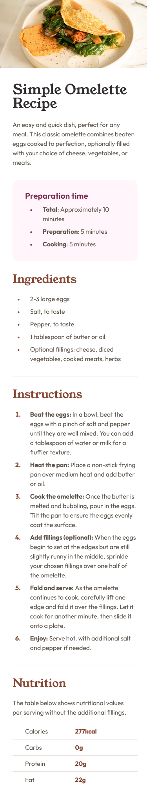
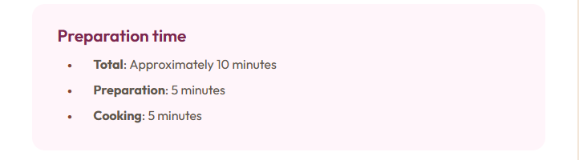

# Frontend Mentor - Recipe page solution

This is a solution to the [Recipe page challenge on Frontend Mentor](https://www.frontendmentor.io/challenges/recipe-page-KiTsR8QQKm). Frontend Mentor challenges help you improve your coding skills by building realistic projects. 

## Table of contents

- [Overview](#overview)
  - [The challenge](#the-challenge)
  - [Screenshot](#screenshot)
  - [Links](#links)
- [My process](#my-process)
  - [Built with](#built-with)
  - [What I learned](#what-i-learned)
  - [Continued development](#continued-development)
- [Author](#author)
- [Acknowledgments](#acknowledgments)


## Overview

### Screenshot

#### Mobile


#### Desktop


### Links

- Solution URL: [Add solution URL here](https://github.com/ashkir004/recipe-page-main)
- Live Site URL: [Add live site URL here](https://your-live-site-url.com)

## My process

### Built with

- Semantic HTML5 markup
- CSS custom properties
- Mobile-first workflow

### What I learned

#### How to Style List Markers

```html
<ul>
  <li><strong>Total</strong>: Approximately 10 minutes</li>
  <li><strong>Preparation</strong>: 5 minutes</li>
  <li><strong>Cooking</strong>: 5 minutes</li>
</ul>
```
```css
ul li::marker {
    font-size: 0.8rem;
    color: var(--Brown-800);
}
```


### Continued development

- How to use Custom CSS Properties on Padding and Margins.

## Author

- Frontend Mentor - [@ashkir004](https://www.frontendmentor.io/profile/ashkir004)

## Acknowledgments

- [frontendmentor.io](https://www.frontendmentor.io/)
- [netlify.io](https://www.netlify.app)
- [github.com](https://www.github.com)
